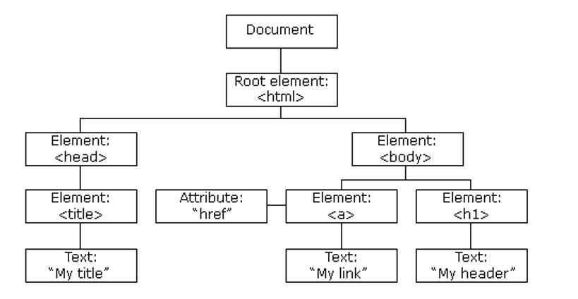

## Document Object Model
The Document Object Model is a standard for how to get, change, add, delete and modify HTML elements.

When a webpage is loaded, the browser creates a Document Object Model(DOM) of the page which is constructed as a tree of objects.

```
<!DOCTYPE html>
<html lang="en">
<head>
  <meta charset="UTF-8">
  <meta name="viewport" content="width=device-width, initial-scale=1.0">
  <title>My title</title>
</head>
<body>
  <a href="#">My link</a>
  <h1>My header</h1>
</body>
</html>
```
The tree of object is as follows:
()

With the Document Object Model, JavaScript gets all the power it needs to work with HTML:
- Changing HTML elements
- Changing attributes of HTML elements
- Change the CSS of hTML elements
- Remove the existing HTML elements
- Create new HTML elements
- Reach to events on a page
